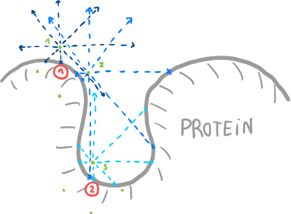

# SBI-PYTHON project
## BITER: a Binding sITEs detectoR for proteins

*https://github.com/P8UXaE/sbipyt*

Authors: Pau Pujol Vives & Junghua Ye

Contact: paupujolvives@gmail.com junhuay00@gmail.com

## Introduction

The detection of binding sites is an important field of study. The development of an algorithm able to detect possible binding sites in several and different molecules is necessary in order to have more specific and personalized drugs and to keep increassing the knowledge level in protein-protein interactions and protein-ligand interactions.
Biter integrates both, geometric pocket detection and machine learning (ML) algorithms in order to get closer to the mentioned objective.

## Tutorial

It is important to have completed those steps:
1.	Have downloaded the biter folder
2.	Have executed the setup.py in order to create the necessary environment

Before running the biter.py script you must have installed all the necessary packages, either in the environment or in the main pyhton libraries folder. If you are using the environment you have to activate it.
```
$ source python3_9venv/bin/activate
```
This command will turn on the environment where you will have executed the setup.py file, and consequently installed the necessary packages. Once you have used the tool, you can deactivate the environment.
```
$ deactivate
```

To run biter you have to type the input file type and the file itself (pdb or mol2). It will generate a solution file that should be called using chimera to show the distribution of probabilities through all the residues to take part on a binding site and the pocket detected withthe geometric algorithm.
To see all the options you can type and mer information (run inside biter/)

```
$ python biter.py --help
```

By typing
```
$ python biter.py -i pdb 1mee.pdb 
```
The program will run all, the ML approach and the geometric approach. This will generate a pdb file that is a single-chain pdb, more suitable to show the results in chimera. As will be printed in the terminal you can run 3 different commands:
```
$ chimera 1mee.pdb 1mee_pocketPoints.pdb
$ chimera 1mmee_chimera.cmd
$ chimera 1mmee_chimera.cmd 1mee_pocketPoints.pdb
```
The first command will open a chimera window showing the points found that are inside a protein pocket. Then, you can go to Favorites > Command Line to activate chimera's command line and type:
```
sel: X
```
Where X is a residue number. In the terminal where you have executed the biter program will appear which are the top 3 clusters of those pocket points. Also, all clusters ordered by distance between the points will appear.
The second command will pop up a chimera window showing the probability of each residue of taking part in a binding process. The theory of everyting is lately explained. The darker the color, the higher the probability.
```
PERCENTAGE  RGB 0-1
0-10%       1,0.96,0.9
10-20%      1,0.91,0.8
20-30%      1,0.85,0.65
30-40%      1,0.75,0.47
40-50%      1,0.66,0.3
50-60%      1,0.57,0.17
60-70%      0.99,0.49,0.08
70-80%      0.97,0.4,0.03
80-90%      0.91,0.35,0.05
90-100%     0.85,0.28,0.06
```
Finnaly, the third command will open a chimera window showing both, the ML approach and the geometric one.

Here some possible commands are shown:  
```
$ python biter.py -i pdb -b protein.pdb myprotein1
```
This calls the program using a pdb type file. It will only generate the ML solution (-b stands for biter, so you can also type --biter). The output files will have 'myprotein1' name on it instead of 'protein'.
```
$ python biter.py -i mol2 -p 1iki.mol2
```
This calls the program using a mol2 type file. It will only generate the geometric solution (-p stands for pocket, so you can also type --pocket). The output files will have '1iki' name on it as a second argument has not been passed to the command.

You can find some examples of the results and the commands used in the examples folder.


## Automatic Setup 

Used to package all the modules or application for the project into a distributable package that can be installed by other users. The script contains information about the package, including its name, version, author, description, and dependencies, among other things.
the setuptools package is needed
```
$ pip install setuptools
```
You can run the setup.sh script to create a python working environment with a particular version of the python (3.9) and it installs and load all the requirements for the project, you just have to activate the environment and you will be able to run the biter programm. 
Before make executable the setup.sh.

```
$ chmod +x setup.sh 
$ ./setup.sh
```
To activate the environment 
```
$ source python3_9venv/bin/activate
```
To deactivate the environment
```
$ deactivate
```

## Create working environment - Manual Setup

If the setup.sh file does not work or you prefer doing it yourself, you can do it manually. First of all you need to create a virtual environment. In order to do this you can run the following comands in the parent folder.
```
$ python3.9 -m venv python3_9venv
```
You can activate the virtual environment by typing the following
```
$ source python3_9venv/bin/activate
```
And you can deactivate the environment by
```
$ deactivate
```
To remove the virtual env (**CAREFUL**: only if you want to delete)
```
$ rm -rf python3_9venv
```
Once you are inside the environment, you can use pip to install any package using pip
```
$ pip install numpy
```

## Training Set

The training set is obtained from *http://bioinfo-pharma.u-strasbg.fr/scPDB/*. It is a mannualy curated database that contains proteins with known binding sites described with points.

This tree represents how files are stored inside the scPDB folder

```
scPDB
├── 1a2b_1
│   ├── IFP.txt
│   ├── cavity6.mol2
│   ├── cavityALL.mol2
│   ├── ints_M.mol2
│   ├── ligand.mol2
│   ├── ligand.sdf
│   ├── protein.mol2
│   └── site.mol2
├── 1a2n_1
│   ├── IFP.txt
│   ├── cavity6.mol2
│   ├── cavityALL.mol2
│   ├── ints_M.mol2
│   ├── ligand.mol2
│   ├── ligand.sdf
│   ├── protein.mol2
│   └── site.mol2
└── 1a4r_1
    ├── IFP.txt
    ├── cavity6.mol2
    ├── cavityALL.mol2
    ├── ints_M.mol2
    ├── ligand.mol2
    ├── ligand.sdf
    ├── protein.mol2
    └── site.mol2
```

The protein structure is extracted from the protein.mol2 file. The atoms that are binding atoms (ommiting H) are labeled thanks to both cavity and site. Cavity is just a mol2 file with spaced dots that represent the cavity where the ligand is placed. The site is a residue subset that are near the cavity. Using those and a discance of x Å we can determine which atoms should be labeled as bindin atoms inside the cavity. Not taking into account any type of bond or Van der Waals force.

The pipeline training process:
1. Open the .pth file (if exists) that contains the model.
2. Using the model, do the calculus and the parameter modification of the model for every atom in a protein.
3. Once all the protein has been evaluated and has been used in order to improve the model, the protein folder is written down in a list in order to not be used again to train the model, given that the program is coded in order to use every protein in scPDB folder to train the model.

This training method does not need any RAM memory to keep data from the training set, once the array of an atom has been used, it is replaced by the next one. In conventional techniques, you need to keep big files with all the data, and the larger the data, the higher the RAM requirement.

In order to run the training algorithm you need to move to the training folder, and have downloaded the full scPDB data in the folder. Then just run
```
$ python train2.py 2> acc2.log
```
This will run the training script. You can see the accuracy only when the ML process has started, after the first 'Computing pocket points...'
```
tail -n 5 acc2.log
```
After trained the model with 279 different molecules (found in already_trained_molecules.txt file) the accuracy is around the 80%.

## PDB working type

The pdb file must be like the following example in order to be integrated in the python class:
(1mee - *https://www.rcsb.org/structure/1MEE*)
```
ATOM      1  N   ALA A   1     -16.582  25.909  46.648  1.00 25.87           N  
ATOM      2  CA  ALA A   1     -16.120  24.544  46.323  1.00 60.37           C  
ATOM      3  C   ALA A   1     -15.090  24.573  45.193  1.00 39.03           C  
ATOM      4  O   ALA A   1     -15.261  25.292  44.195  1.00 25.75           O  
ATOM      5  CB  ALA A   1     -17.257  23.611  45.965  1.00 31.78           C  
ATOM      6  N   GLN A   2     -14.060  23.750  45.366  1.00 24.97           N  
ATOM      7  CA  GLN A   2     -13.012  23.760  44.315  1.00 17.40           C  
ATOM      8  C   GLN A   2     -13.100  22.564  43.399  1.00 15.42           C  
ATOM      9  O   GLN A   2     -13.394  21.452  43.865  1.00 14.10           O  
ATOM     10  CB  GLN A   2     -11.668  23.893  45.007  1.00 14.39           C  
ATOM     11  CG  GLN A   2     -10.450  23.827  44.068  1.00 12.20           C  
```
This pdb type won't work:
(8ad1 - *https://www.rcsb.org/structure/8AD1*)
```
ATOM    433  P    DC N 263     157.725 135.829 113.933  1.00255.48           P  
ATOM    434  OP1  DC N 263     158.817 136.674 113.402  1.00255.48           O  
ATOM    435  OP2  DC N 263     156.489 135.643 113.142  1.00255.48           O  
ATOM    436  O5'  DC N 263     158.316 134.384 114.274  1.00255.48           O  
ATOM    437  C5'  DC N 263     159.510 134.274 115.034  1.00255.48           C  
ATOM    438  C4'  DC N 263     159.692 132.864 115.565  1.00255.48           C  
ATOM    439  O4'  DC N 263     158.576 132.513 116.426  1.00255.48           O  
ATOM    440  C3'  DC N 263     159.760 131.766 114.501  1.00255.48           C  
ATOM    441  O3'  DC N 263     160.725 130.801 114.890  1.00255.48           O  
ATOM    442  C2'  DC N 263     158.349 131.183 114.538  1.00255.48           C  
ATOM    443  C1'  DC N 263     158.064 131.264 116.024  1.00255.48           C  
```

## Theory

The binding sites detector is coded mainly as a machine learning approach. It first computes some data and using the pytorch package it trains an artificial intelligence that is capable to predict if each atom of a molecule takes part on a binding site or not. Lately, to filter the solutions, a clustering algorithm is computed in order to detect regions with high positive solution density. It wouldn't consider the Hidrogen molecules and train a model based on atomical level. To get every data row passed to the model, it must compute some features:
1. Every row contains the atom that we are evaluating and its 15 nearest neighbors.
2. For every neighbor:

    a) SASA value

    b) Direction respect the main atom

    c) The secondary structure of the residue of which the atom pertains

    d) Lenard-Jones potential

    e) Hydrophobicity of the residue of which the atom pertains

    f) 10 nearest distances to geometric possible binding points


        a) SASA value:

The SASA (solvent-accessible surface area) value is computed using the Biopython package.
SASA (Solvent Accessible Surface Area) is a program that calculates the solvent-accessible surface area of a molecule, which is a measure of the exposed surface area of a molecule that is available for interaction with solvent molecules. The SASA program calculates the surface area of a molecule by using an algorithm that defines the solvent-accessible surface as the surface that can be reached by a probe sphere that rolls along the surface of the molecule without penetrating it.
The output of the SASA program typically includes a feature matrix and an adjacent matrix that describe the molecule's surface area and connectivity, respectively.
The feature matrix contains a row for each atom in the molecule and a column for each feature, such as the SASA, atomic radius, or charge. The SASA value for each atom is usually included as one of the features in the matrix.

The adjacent matrix describes the connectivity between atoms in the molecule, typically in the form of a sparse matrix where each row and column corresponds to an atom, and the entries indicate the strength of the bond between the atoms. In some cases, the adjacent matrix may also include information on non-covalent interactions, such as hydrogen bonds or Van der Waals interactions.

It uses “the “rolling ball” algorithm developed by Shrake & Rupley algorithm, which uses a sphere (of equal radius to a solvent molecule) to probe the surface of the molecule.” [https://biopython.org/docs/dev/api/Bio.PDB.SASA.html]

        b) Direction respect the main atom

The objective of this precalculus is to both describe the protein structure using several features and adding as much relevant information as possible.
One of the ways to describe the structure is to know the direction of the 15 nearest neighbors of each atom.
This is basically computed using numpy arrays, and subtractions that result on a direction

$$(AB)=A-B$$

        c) Secondary structure

The secondary structure of the protein is computed using the Φ and Ψ angles for the helix structure. For the beta sheet, the angle computed is the resulting between the N-H bond and the O.

Alpha helix:
For the alpha helix, the number of residues between one and another residue goes from 3 to 5. Also, the distance between those residues is less than 3.4 Å. Also Φ has to be 92 ± 35 %, and Ψ must be 98 ± 35 %.

$n_{rj} = n_{ri} + 3,4,5$

$d(n_{rj}, n_{ri}) < 3.4$

$92 - 32.2 < \Phi < 92 + 32.2$

$98 - 34.3 < \Psi < 98 + 34.3$


Beta sheet:
For the beta sheet first the distance between Ni and Oj must be < 3.2 Å. Then a H is placed in the same plane as Cα-N-C at a distance of the midpoint of Cα-C, but in the opposite direction. Having placed the H in between Ni and Oj it is time to calculate the angle being H the vertex. The angle must be 180 ± 15 %.

        d) Lennard-Jones potential

It returns a matrix with the potential for every pair of atoms.

$$W(r)=4ε((σ/r)^{12}-(σ/r)^6 )$$

ε and σ are obtained from a library that has those values from each pair of atoms [https://github.com/choderalab/ambermini/blob/master/share/amber/dat/leap/parm/parm99.dat].

        e) Hydrophobicity

In order to transform the letter symbol of each residue and to add hydrophobicity information, a library that contains different hydrophobicity types is used [https://www.cgl.ucsf.edu/chimera/docs/UsersGuide/midas/hydrophob.html#anote].

        f) Geometry based.

To add more information about the geometry of the molecule its used a script that calculates points around the protein that are placed on concave regions.
This script uses the SASA values to know which atoms do have accessible area, then it places points from [x-3, y-3, z-3] to [x+3, y+3, z+3] with a 3 value step. Once it has the points it calculates whether each point is inside another atom or not. If not, it throws other points until reached a distance of 15 or a collision with another atom. Once it has all the collisions it calculates the area of first sphere that is occupied by the collisions. A draw in 2D molecule representation is shown for a better understanding.



In this 2D example we can see 2 atoms (red spheres) with SASA > 0. In this particular example each atom throws possible points (green dots). Those points can be inside of another atom, that would be the case of the green dots inside the protein, or outside the protein. Later on, using the outside of protein green points, lines are thrown in 45º difference in all directions from distance 2 to 15 or until collision.
Once we have all the collisions we know the θ and ϕ angles (in the case of the sphere). In the case of 2D protein we would have just one angle. Now, we have to know which angles do provide a collision with the protein. If it is 0.5 or higher of the sphere we know we are in a concave site. That would be the case of 2 and 3 green dots.
When working in 3D, the area of the sphere is computed using θ and ϕ angles, so in that case we search for an area equal or grater than 2π. 
Once the program has all the points, it adds 10 features foreach atom, those features being the 10 nearest distances to those points using KDTrees algorithm.

All this information is fed to the machine learning approach. For every molecule, it’s feed each single atom (avoiding H because some pdb may not have this information). 

The data used is a curated database that each protein has at least one known binding site, so that leads to a good data used.

The algorithm for training opens the folder called scPDB and loads one at time protein.mol2 file. It is continuously learning, the program does not need to learn on one single dataframe. This is more useful, because the computational resources needed are less that when trying to load large amounts of information in a single time.
Every protein loop the program loads the existing model and tries to improve it, when all the atoms of the protein have passed through the ML, the new model is saved, also the protein used is written down on a file. This way the algorithm can be paused at any time, and the information lost will just be the modified model with the protein running at the pause moment.

Using all this data the model has an accuracy of ~80%, being the difference with the target (1 or 0) and the prediction.

## Further progress

While developing the algorithm some further investigation was thought:
1. Instead of working using single atoms, precalcualte the residue properties as a mean of all the atoms and use the residues to feed the ML model. This way less data to feed the ML is used and less variaty is seen.
2. Use techniques such as upgrading the minority group. This way we could rise the atoms or residues taking part in binding processes to higher levels, up to 50%. This could result in a better output and accuracy of the model.


