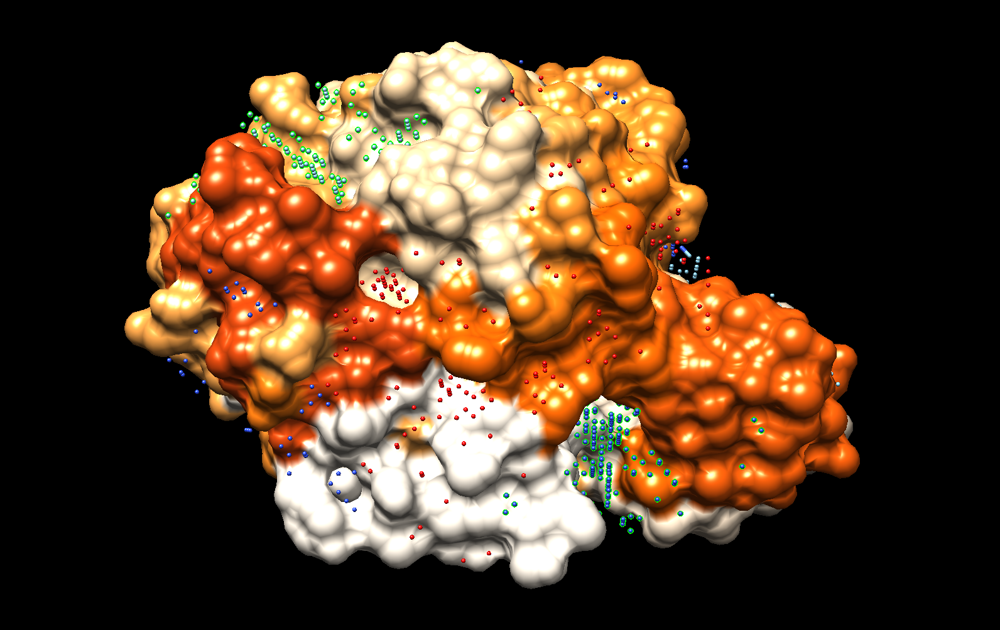

After running the command
$ python biter.py -i pdb 1mee.pdb
The results shown in the console are the following:

```bash
 -- Computing pocket points...: 100%|████████████████████████████| 41529/41529 [00:36<00:00, 1130.23it/s]
------------------------------
Please, check the top 3 clusters
Go to Chimera, open the protein requested and open the _pocketPoints.pdb file. You can use:
$ chimera 1mee.pdb 1mee_pocketPoints.pdb
Then activate the command line; Favorites > Command Line
Type ´sel: X´ to select and visualize the Clusters detected of pocket binding sites.
------------------------------
Best cluster by distance: 1
Top 3 clusters by distance: [1, 3, 2]
All clusters: [1, 3, 2, 4, 10, 0, 7, 6, 5, 8, 9]
------------------------------
Generating atom probabilities...: 100%|██████████████████████████████| 2478/2478 [25:23<00:00,  1.63it/s]
------------------------------
To visualize the results run the following command:
$ chimera 1mee_chimera.cmd
------------------------------
You can visualize all the results as:
$ chimera 1mee_chimera.cmd 1mee_pocketPoints.pdb
```



As seen, the best clusters of pocket points indicate the pockets in the protein. Meanwhile, the residues with a darker color indicate higher probability of taking part in a binding process.
Residues near a pocket have a darker orange color. Also some residues that are placed in a pointing part of the proten have also this darker color. This could indicate that this part could bind to another protein being the ligand protein.