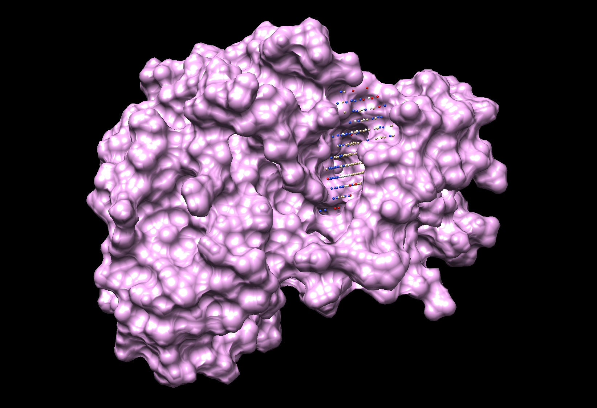
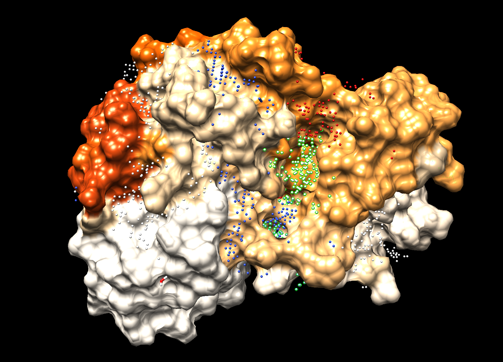

After running the command
$ python biter.py -i mol2 scPDB/3r28_1/protein.mol2 3r28
Whith those commands we are telling it to change the file names 3r28 instead of protein.
The results shown in the console are the following:

```bash
python biter2.py -i mol2 scPDB/3r28_1/protein.mol2 3r28
 -- Computing pocket points...: 100%|█████████████████████████████| 41512/41512 [01:00<00:00, 689.34it/s]
------------------------------
Please, check the top 3 clusters
Go to Chimera, open the protein requested and open the _pocketPoints.pdb file. You can use:
$ chimera scPDB/3r28_1/protein.mol2 3r28_pocketPoints.pdb
Then activate the command line; Favorites > Command Line
Type ´sel: X´ to select and visualize the Clusters detected of pocket binding sites.
------------------------------
Best cluster by distance: 15
Top 3 clusters by distance: [15, 10, 2]
All clusters: [15, 10, 2, 1, 4, 5, 3, 0, 9, 13, 8, 12, 11, 7, 6, 14]
------------------------------
Generating atom probabilities...: 100%|██████████████████████████████| 2366/2366 [12:38<00:00,  3.12it/s]
------------------------------
To visualize the results run the following command:
$ chimera 3r28_chimera.cmd
------------------------------
You can visualize all the results as:
$ chimera 3r28_chimera.cmd 3r28_pocketPoints.pdb
```
In this first image can be seen the known binding site of 3r28 protein. It is located in a pocket.


This image shows the the prediction of the ML program and the pocket clusters calculated.


As can be seen, the best clusters of the binding pockets are actually the same as the known and manually curated sites. But the prediction of the ML algorithm did not predict as good as the pocket algorithm, it was capable of detecting the site in a low probability, but the highest probability was not placed in the known binding site. It also well discarted half of the protein of being binding site.