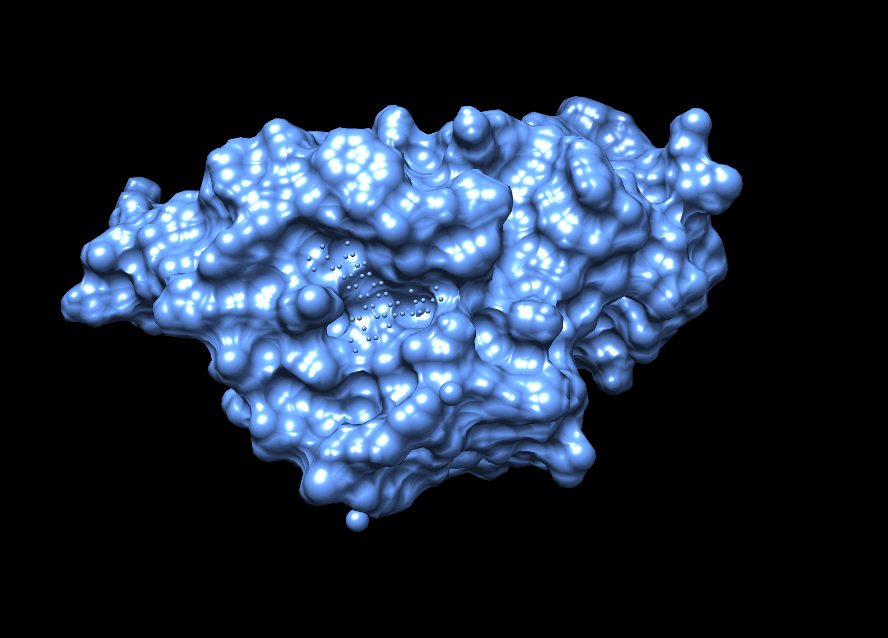
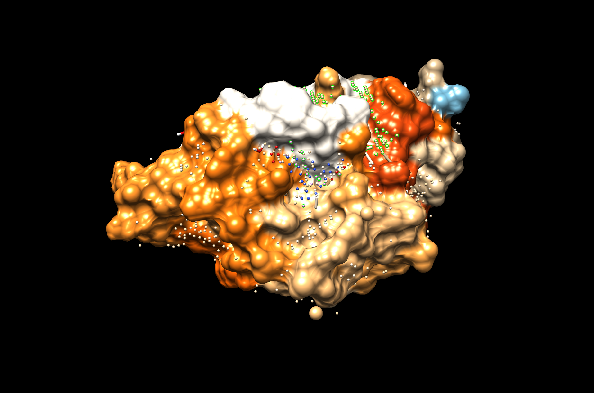

After running the command
```
$ python biter2.py -i mol2 scPDB/7std_3/protein.mol2 7std
```
The results shown in the console are the following:

```bash
 -- Computing pocket points...: 100%|████████████████████████████████████████████████████████████████████████████████████████████| 24014/24014 [00:43<00:00, 557.21it/s]
------------------------------
Please, check the top 3 clusters
Go to Chimera, open the protein requested and open the _pocketPoints.pdb file. You can use:
$ chimera scPDB/7std_3/protein.mol2 7std_pocketPoints.pdb
Then activate the command line; Favorites > Command Line
Type ´sel: X´ to select and visualize the Clusters detected of pocket binding sites.
------------------------------
Best cluster by distance: 8
Top 3 clusters by distance: [8, 6, 5]
All clusters: [8, 6, 5, 2, 12, 13, 16, 3, 7, 9, 14, 4, 1, 15, 10, 0, 11]
------------------------------
Generating atom probabilities...: 100%|█████████████████████████████████████████████████████████████████████████████████████████████| 1369/1369 [04:26<00:00,  5.14it/s]
------------------------------
To visualize the results run the following command:
$ chimera 7std_chimera.cmd
------------------------------
You can visualize all the results as:
$ chimera 7std_chimera.cmd 7std_pocketPoints.pdb
```

In this first image can be seen the known binding site of 7std protein. It is located in a pocket.


This image shows the the prediction of the ML program and the pocket clusters calculated.


We can notice that the cavity which the ligand binds was predicted as one of the best cluster found by the programm. there are several points inside the cavity recognized as binding site. However, there are other regions that seems that could a binding site. It works good for ligands that binds in small and monomeric proteins. 